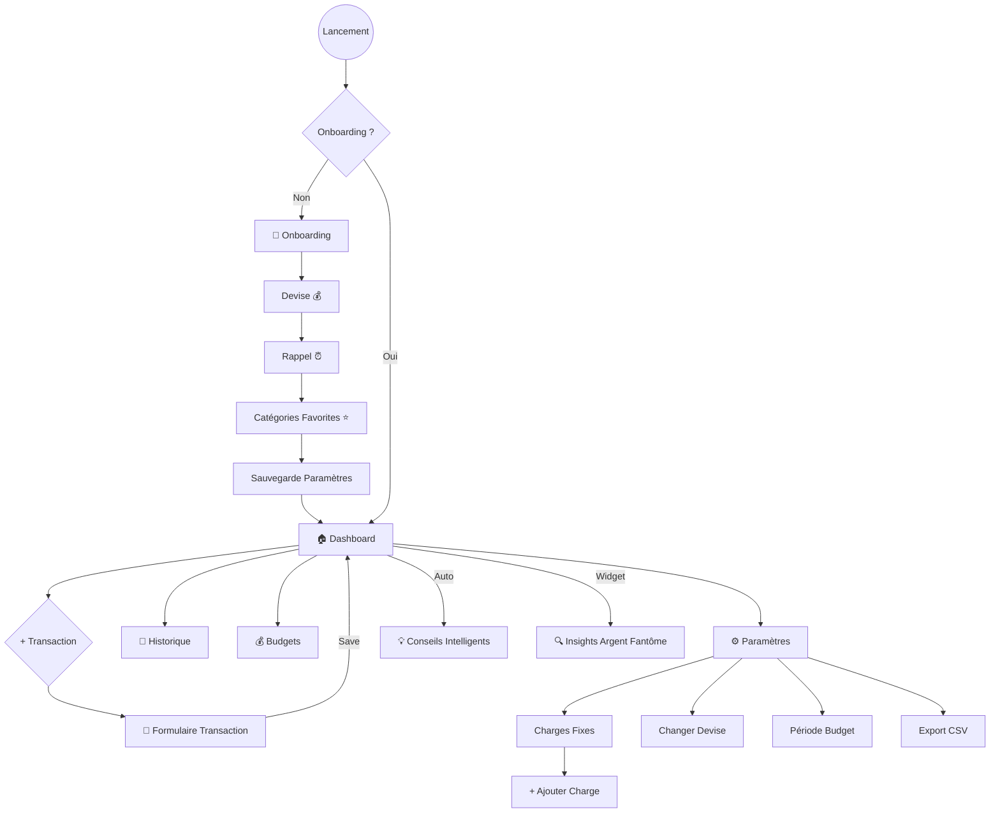

# 🔄 Parcours Utilisateur (User Flow)

Ce document détaille les flux de navigation et d'interaction actuels dans l'application BudgetEase.

## 🗺️ Diagramme de Flux Global

## 👣 Détail des Parcours

### 1. 🌊 Première Utilisation (Onboarding)
Le parcours pour un nouvel utilisateur, conçu pour être rapide et sans friction (pas de compte).

1.  **Splash Screen** : Vérification de l'état local.
2.  **Sélection Devise** : Choix unique (FCFA, NGN, GHS, USD, EUR).
3.  **Configuration Rappel** :
    *   Activation optionnelle des notifications.
    *   Choix de l'heure (TimePicker).
4.  **Favoris** : Sélection de 3 catégories principales pour accès rapide.
5.  **Finalisation** : Redirection immédiate vers le Dashboard.

### 2. 🏠 Usage Quotidien (Dashboard)
Le hub central de l'application.

*   **En-tête** : Résumé intelligent adaptatif (Budget Réel Disponible).
*   **Conseils** : Cartes contextuelles qui apparaissent selon la situation (ex: "Loyer dans 3 jours").
*   **Actions Rapides** :
    *   **FAB (Bouton Flottant)** : Ouvre le formulaire de transaction.
*   **Navigation** : Barre inférieure persistante (Dashboard, Historique, Budgets, Paramètres).

### 3. 📝 Création de Transaction
L'action principale de l'utilisateur.

1.  **Entrée** : Via le bouton `+` du Dashboard.
2.  **Formulaire** :
    *   **Type** : Dépense (défaut) ou Revenu.
    *   **Montant** : Clavier numérique.
    *   **Catégorie** : Liste déroulante (Favoris en premier).
    *   **Paiement** : MoMo, Cash, Carte.
    *   **Fréquence** (si Revenu) : Journalier/Hebdo/Mensuel (Impacte les calculs intelligents).
    *   **Note** : Optionnel.
3.  **Validation** : Mise à jour immédiate des calculs et du stockage local.

### 4. ⚙️ Gestion & Paramètres
Accessible depuis l'onglet Paramètres.

*   **Charges Fixes** : Liste et ajout de charges récurrentes (Loyer, Netflix...).
*   **Configuration** : Modification de devise, période budgétaire (Jour/Semaine/Mois).
*   **Données** : Export CSV pour sauvegarde externe ou analyse Excel.

## 🧠 Points d'Interaction Intelligents ("Smart Coach")

L'application agit proactivement à plusieurs moments du flux :

*   **Au lancement du Dashboard** : Le `AdvisorService` analyse les données pour générer des alertes (ex: dépense trop rapide par rapport à la moyenne).
*   **Sur l'écran Insights** : Détection de patterns "Argent Fantôme" (micro-dépenses répétées).
*   **Lors de la planification** : Le `PeriodCalculator` ajuste les recommandations budgétaires selon si l'utilisateur pense en "Semaine" ou en "Mois".
