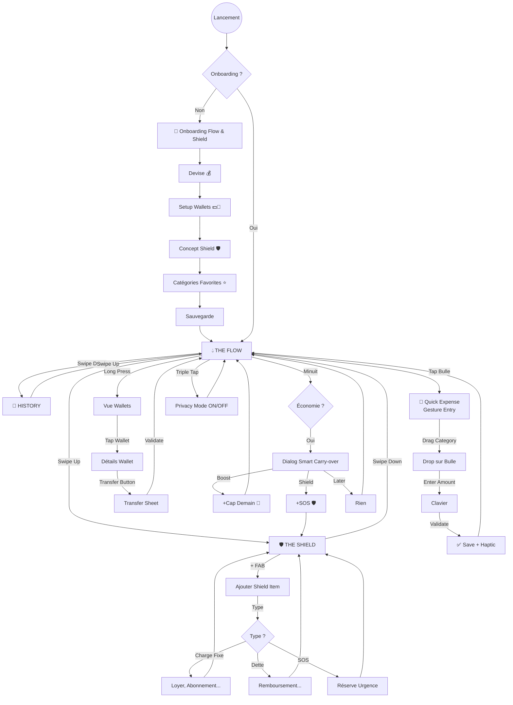

# 🔄 Parcours Utilisateur - Flow & Shield Edition

Ce document détaille les flux de navigation révolutionnaires de BudgetEase v4.0 basés sur le concept **Flow & Shield**.

---

## 🎯 Philosophie : L'Axe Vertical

L'application abandonne la navigation horizontale classique pour un **axe vertical intuitif** :

```
        ↑ SWIPE UP
    ════════════════
    🛡️ THE SHIELD
      (Le Futur)
    ════════════════
          
    - - - - - - - -
          
    💧 THE FLOW
    (Le Présent)
    
    - - - - - - - -
          
    ════════════════
    📜 HISTORY
     (Le Passé)
    ════════════════
        ↓ SWIPE DOWN
```

---

## 🗺️ Diagramme de Flux Global



---

## 👣 Détail des Parcours

### 1. 🌊 Première Utilisation (Onboarding Flow & Shield)

**Objectif** : Introduire les concepts fondamentaux en **< 2 minutes**.

#### Étapes

1. **Splash Screen**
   - Animation liquide Flow & Shield
   - Chargement de la base de données chiffrée

2. **Sélection Devise** (Écran 1)
   ```
   ┌─────────────────────────────────┐
   │  Quelle est ta devise locale ?  │
   │                                 │
   │  ○ FCFA (Franc CFA)             │
   │  ○ NGN (Naira)                  │
   │  ○ GHS (Cedi)                   │
   │  ○ USD (Dollar)                 │
   │  ○ EUR (Euro)                   │
   │                                 │
   │          [Continuer →]          │
   └─────────────────────────────────┘
   ```

3. **Setup Wallets** (Écran 2)
   ```
   ┌─────────────────────────────────┐
   │    Où gardes-tu ton argent ?    │
   │                                 │
   │  ✓ 💵 Cash Physical             │
   │  ✓ 📱 MTN Mobile Money          │
   │  ☐ 🍊 Orange Money              │
   │  ☐ 💳 Carte Bancaire            │
   │                                 │
   │  Tu pourras les gérer séparément│
   │                                 │
   │          [Continuer →]          │
   └─────────────────────────────────┘
   ```

4. **Concept Shield** (Écran 3)
   ```
   ┌─────────────────────────────────┐
   │     🛡️ LE BOUCLIER (Shield)     │
   │                                 │
   │  C'est l'argent "sacré" :       │
   │  • Loyer & charges fixes        │
   │  • Dettes à rembourser          │
   │  • Réserve SOS (urgences)       │
   │                                 │
   │  [Animation : bouclier protège  │
   │   une réserve de pièces]        │
   │                                 │
   │          [Continuer →]          │
   └─────────────────────────────────┘
   ```

5. **Concept Flow** (Écran 4)
   ```
   ┌─────────────────────────────────┐
   │      💧 LE FLUX (Flow)          │
   │                                 │
   │  C'est ton argent dynamique     │
   │  lissé en un Daily Cap :        │
   │                                 │
   │  ╭───────────────────╮          │
   │  │  ≋≋≋≋≋≋≋≋≋≋≋≋≋≋  │          │
   │  │ ≋≋≋≋≋≋≋≋≋≋≋≋≋≋≋≋ │          │
   │  ╰───────────────────╯          │
   │     3 500 FCFA/jour             │
   │                                 │
   │          [Continuer →]          │
   └─────────────────────────────────┘
   ```

6. **Catégories Favorites** (Écran 5)
   ```
   ┌─────────────────────────────────┐
   │  Choisis 3 catégories principales│
   │                                 │
   │  [🍔 Alimentation]  ✓           │
   │  [🚕 Transport]     ✓           │
   │  [📱 Téléphone]                 │
   │  [🏠 Logement]                  │
   │  [💊 Santé]         ✓           │
   │                                 │
   │          [Terminer 🚀]          │
   └─────────────────────────────────┘
   ```

7. **Redirection** → The Flow (écran central)

---

### 2. 💧 The Flow (Écran Central - Présent)

**Fonction** : Vue principale avec la jauge liquide interactive.

#### Layout

```
┌───────────────────────────────────────┐
│  BudgetEase        [⋮] [👁️ Privacy]  │ ← AppBar
├───────────────────────────────────────┤
│                                       │
│         Swipe ↑ vers Shield           │
│                                       │
│  ┌─────────────────────────────────┐  │
│  │                                 │  │
│  │       💧 THE FLOW               │  │
│  │                                 │  │
│  │     ╭─────────────────╮         │  │
│  │    ╱  ≋≋≋≋≋≋≋≋≋≋≋≋  ╲        │  │
│  │   │  ≋≋≋≋≋≋≋≋≋≋≋≋≋≋  │       │  │
│  │   │ ≋≋≋≋≋≋≋≋≋≋≋≋≋≋≋≋ │       │  │
│  │    ╲  ≋≋≋≋≋≋≋≋≋≋≋≋  ╱        │  │
│  │     ╰─────────────────╯         │  │
│  │                                 │  │
│  │     12 500 FCFA restants        │  │
│  │     (sur 15 000 FCFA)           │  │
│  │                                 │  │
│  └─────────────────────────────────┘  │
│                                       │
│  ╭───────────────────────────────╮   │
│  │ Tap pour enregistrer dépense  │   │
│  │ Long press → voir wallets     │   │
│  ╰───────────────────────────────╯   │
│                                       │
│         Swipe ↓ vers History          │
│                                       │
└───────────────────────────────────────┘
│   ●  ●  ●                            │ ← Indicateur vertical
```

#### Interactions

| Geste | Action |
|-------|--------|
| **Tap bulle** | Ouvre Quick Expense (gesture entry) |
| **Long press bulle** | Affiche vue Wallets |
| **Swipe Up** | Navigate → Shield Screen |
| **Swipe Down** | Navigate → History Screen |
| **Triple tap écran** | Toggle Privacy Mode |

---

### 3. 🛡️ The Shield (Écran Haut - Futur)

**Fonction** : Visualiser et gérer l'argent "sacré" (charges fixes, dettes, SOS).

#### Layout

```
┌───────────────────────────────────────┐
│  ← The Shield      [+]                │
├───────────────────────────────────────┤
│                                       │
│  ╭───────────────────────────────╮   │
│  │   TOTAL SHIELD : 85 000 FCFA  │   │
│  │   (Argent réservé, intouchable)│   │
│  ╰───────────────────────────────╯   │
│                                       │
│  📌 CHARGES FIXES                     │
│  ┌─────────────────────────────────┐ │
│  │ 🏠 Loyer                        │ │
│  │ 50 000 FCFA/mois                │ │
│  │ Échéance: 28 février (22j)      │ │
│  └─────────────────────────────────┘ │
│  ┌─────────────────────────────────┐ │
│  │ 🌐 Internet ADSL                │ │
│  │ 15 000 FCFA/mois                │ │
│  │ Échéance: 15 février (9j)       │ │
│  └─────────────────────────────────┘ │
│                                       │
│  💳 DETTES                            │
│  ┌─────────────────────────────────┐ │
│  │ Prêt Moto                       │ │
│  │ 20 000 FCFA/mois                │ │
│  │ Reste: 120k (6 mois)            │ │
│  │ ████░░░░░░ 60%                  │ │
│  └─────────────────────────────────┘ │
│                                       │
│  🚨 MODE SOS                          │
│  ┌─────────────────────────────────┐ │
│  │ Réserve d'urgence : 0 FCFA      │ │
│  │ [Activer Mode SOS]              │ │
│  └─────────────────────────────────┘ │
│                                       │
│         Swipe ↓ vers Flow             │
└───────────────────────────────────────┘
```

#### Actions

- **[+] FAB** : Ajouter Shield Item (Charge/Dette/SOS)
- **Tap item** : Modifier ou désactiver
- **Swipe item left** : Supprimer (avec confirmation)

---

### 4. 📜 History (Écran Bas - Passé)

**Fonction** : Historique des transactions et insights.

#### Layout

```
┌───────────────────────────────────────┐
│  ← History         [Filtres]          │
├───────────────────────────────────────┤
│         Swipe ↑ vers Flow             │
│                                       │
│  🔍 INSIGHTS                          │
│  ┌─────────────────────────────────┐ │
│  │ 👻 Argent Fantôme Détecté       │ │
│  │ 8 cafés = 2 400 FCFA (12%)      │ │
│  │ [Voir détails →]                │ │
│  └─────────────────────────────────┘ │
│                                       │
│  📅 AUJOURD'HUI                       │
│  ┌─────────────────────────────────┐ │
│  │ 🍔 Déjeuner          -2 500     │ │
│  │ Cash                  14:30     │ │
│  └─────────────────────────────────┘ │
│  ┌─────────────────────────────────┐ │
│  │ 🚕 Taxi              -500       │ │
│  │ Cash                  09:15     │ │
│  └─────────────────────────────────┘ │
│                                       │
│  📅 HIER                              │
│  ┌─────────────────────────────────┐ │
│  │ 💰 Salaire           +150 000   │ │
│  │ MTN MoMo              08:00     │ │
│  └─────────────────────────────────┘ │
│  ┌─────────────────────────────────┐ │
│  │ 🔄 Transfer Cash←MoMo 10 000    │ │
│  │                       16:45     │ │
│  └─────────────────────────────────┘ │
│                                       │
└───────────────────────────────────────┘
```

---

### 5. 💸 Quick Expense (Gesture Entry)

**Nouveauté** : Plus de formulaire, tout en gestures.

#### Flow

```
Étape 1: TAP sur bulle Flow
    ↓
Étape 2: DRAG une catégorie vers le centre
    ↓  (Haptic medium)
Étape 3: ENTER montant (clavier numérique)
    ↓
Étape 4: TAP ✓ pour valider
    ↓  (Haptic heavy)
Étape 5: Retour Flow avec animation
```

#### Écran

```
┌───────────────────────────────────────┐
│  Quick Expense     [✓ Valider]        │
├───────────────────────────────────────┤
│                                       │
│          ╭─ DragTarget ─╮            │
│         ╱                ╲           │
│        │  🍔 Alimentation │          │
│        │                  │          │
│         ╲                ╱           │
│          ╰──────────────╯            │
│                                       │
│         2 500 FCFA                   │
│                                       │
│  ┌─────────────────────────────────┐ │
│  │   [7]  [8]  [9]     [⌫]        │ │
│  │   [4]  [5]  [6]     [00]       │ │
│  │   [1]  [2]  [3]     [000]      │ │
│  │        [0]  [.]                 │ │
│  └─────────────────────────────────┘ │
│                                       │
│  Catégories favorites (drag):        │
│  [🍔] [🚕] [📱] [🎮] [💊] →         │
│                                       │
└───────────────────────────────────────┘
```

---

### 6. 🔄 Smart Carry-over (Minuit)

**Automatique** : Chaque jour à minuit, si économie détectée.

#### Flow

```
23:59:59 → Jour se termine
    ↓
00:00:00 → Background task déclenché
    ↓
Calculer : Cap alloué - Dépensé = ?
    ↓
Si > 0 → Afficher dialog au réveil
    ↓
Choix utilisateur (3 options)
```

#### Dialog

```
┌─────────────────────────────────────┐
│                                     │
│          🎉 Bravo !                 │
│                                     │
│     Tu as économisé hier :          │
│         2 000 FCFA                  │
│                                     │
│    Que veux-tu en faire ?           │
│                                     │
│  ┌───────────────────────────────┐ │
│  │ 🚀 Booster demain             │ │
│  │ +2 000 sur ton Daily Cap      │ │
│  └───────────────────────────────┘ │
│                                     │
│  ┌───────────────────────────────┐ │
│  │ 🛡️ Renforcer le Bouclier      │ │
│  │ Augmenter ta réserve SOS      │ │
│  └───────────────────────────────┘ │
│                                     │
│         [Plus tard]                 │
│                                     │
└─────────────────────────────────────┘
```

---

### 7. 💵 Wallets Management

**Accès** : Long press sur bulle Flow.

#### Vue Wallets

```
┌─────────────────────────────────────┐
│  Mes Portefeuilles    [+ Ajouter]   │
├─────────────────────────────────────┤
│                                     │
│  ┌─────────────┐  ┌─────────────┐  │
│  │ 💵 Cash     │  │ 📱 MTN MoMo │  │
│  │             │  │             │  │
│  │ 25 000 FCFA │  │ 45 000 FCFA │  │
│  └─────────────┘  └─────────────┘  │
│                                     │
│  ┌─────────────┐  ┌─────────────┐  │
│  │ 🍊 Orange $ │  │ 💳 Carte    │  │
│  │             │  │             │  │
│  │ 12 000 FCFA │  │ 80 000 F... │  │
│  └─────────────┘  └─────────────┘  │
│                                     │
│  ╭───────────────────────────────╮ │
│  │ TOTAL : 162 000 FCFA          │ │
│  ╰───────────────────────────────╯ │
│                                     │
│  [Transfer entre wallets]           │
│                                     │
└─────────────────────────────────────┘
```

---

## 🧠 Mécaniques Intelligentes Automatiques

### 1. Income Predictor (Arrière-plan)

**Quand** : Chaque calcul de Daily Cap
**Si** : Pas de revenu saisi ce mois
**Alors** : Utiliser prédiction basée sur historique 90 jours

```
┌─────────────────────────────────────┐
│  Daily Cap : 3 500 FCFA (Estimé)    │
│                                     │
│  ℹ️ Basé sur ta moyenne de revenus  │
│  des 3 derniers mois.               │
│                                     │
│  Enregistre ton revenu pour un      │
│  calcul plus précis.                │
└─────────────────────────────────────┘
```

### 2. Ghost Money Detection (Hebdo)

**Quand** : Dimanche soir
**Déclencheur** : > 5 micro-dépenses < 500 FCFA
**Affichage** : Carte insight dans History

### 3. Velocity Alerts (Temps réel)

**Conditions** :
- Dépenses du jour > 2× moyenne quotidienne
- ET montant significatif (> 1000 FCFA)

**Toast** :
```
⚠️ Dépenses rapides aujourd'hui
Déjà 8 500 FCFA (vs 4 000 avg)
```

---

## 📊 Analytics & Privacy

**Zero tracking** : Toutes les analyses sont **100% locales**.

Aucune donnée n'est envoyée à un serveur. L'utilisateur garde le contrôle absolu via :
- Export CSV régulier
- Privacy Mode (floutage)
- Chiffrement AES-256 des données

---

**Dernière mise à jour** : 6 février 2026  
**Version** : v4.0 "Flow & Shield Edition"
